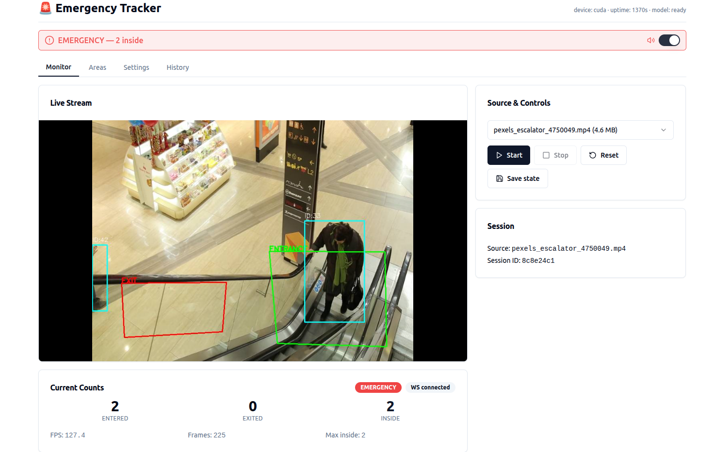

# 🚨 YOLOv8 Emergency Tracker

[](https://www.python.org/downloads/)
[](https://fastapi.tiangolo.com/)
[](https://react.dev/)
[](https://docs.ultralytics.com/)
[](https://opensource.org/licenses/MIT)

건물 내부의 사람 수를 실시간으로 추적·집계하고, 과밀 임계값 초과 시 이메일·Slack·Discord 등으로 즉시 알림을 보내는 AI 기반 모니터링 시스템.

웹캠/저장 영상에서 YOLOv8로 사람을 탐지 → centroid 트래커로 ID 부여 → 진입/퇴장 영역 폴리곤으로 카운팅 → 임계값 초과 시 알림 발송, 그리고 그 결과를 브라우저에서 라이브 미리보기·설정·영역 편집 UI로 다룬다.



> 📐 시스템 구조와 클래스 다이어그램은 [`docs/architecture.md`](docs/architecture.md), [`docs/uml.md`](docs/uml.md) 참조.

---

## ✨ 주요 기능

- **실시간 사람 탐지·추적**: YOLOv8 (`yolov8s.pt` 기본) + centroid 트래커. CPU/CUDA/MPS 자동 선택.
- **영역 기반 카운팅**: entrance / exit 폴리곤을 브라우저에서 드래그로 편집. `current_inside`, `max_inside_seen` 실시간 표시.
- **임계값 알림**: warning / overcrowding 두 단계. Email(SMTP), Slack, Discord, 커스텀 웹훅 지원. quiet_hours·interval 억제.
- **라이브 프리뷰**: MJPEG 스트림 (``) + 2 Hz WebSocket 상태 푸시. 별도 GUI 창 없음.
- **세션 영속화**: 5분 주기 또는 수동으로 `backend/output/session_state.json` 저장. 시작 시 복원 가능.
- **단일 토큰 인증**: `APP_TOKEN` 한 개로 REST/WS/stream 보호. 미설정 시 개발 모드(127.0.0.1 가정).

---

## 🏗️ 구성

```
yolov8-emergency-tracker/
├── backend/                   FastAPI + YOLOv8 워커
│   ├── app/                   API 라우터, 인증, VideoService
│   ├── config.py / config.json  영속 설정
│   ├── detector.py            YOLODetector
│   ├── tracker.py             centroid Tracker
│   ├── counter.py             AreaCounter (polygon in/out)
│   ├── notification.py        Email/Slack/Discord/Webhook
│   ├── dataset/               입력 비디오 (mp4 등) — 화이트리스트 경로
│   ├── output/                세션 스냅샷·통계 JSON
│   ├── tests/                 pytest
│   └── yolov8s.pt             모델 가중치
├── frontend/                  React 18 + Vite + Tailwind + shadcn/ui
│   └── src/{api,hooks,components}
└── docs/                      architecture.md / uml.md
```

자세한 모듈 책임표·데이터 흐름은 `docs/architecture.md` 참고.

---

## 💻 시스템 요구사항

- **OS**: Linux / macOS / Windows
- **Python**: 3.10 이상
- **Node.js**: 18.18 이상 (frontend 빌드용)
- **GPU (선택)**: CUDA 11.8+ 또는 Apple Silicon MPS. CPU에서도 동작.
- **카메라**: USB 웹캠 또는 `backend/dataset/*.mp4` 파일

OpenCV가 OS 의존성을 요구하는 경우(Ubuntu에서 `libGL` 등) 시스템 패키지를 설치해야 한다. headless 환경이면 `opencv-python-headless` 사용을 고려.

---

## 🛠️ 설치

### 1. 저장소 클론

```bash
git clone <repo-url> yolov8-emergency-tracker
cd yolov8-emergency-tracker
```

### 2. 백엔드

```bash
cd backend
python -m venv .venv
source .venv/bin/activate          # Windows: .venv\Scripts\activate
pip install -r requirements.txt
cp .env.example .env                # 토큰/이메일 등 채우기
```

`.env`에서 최소한 다음을 검토:

| 변수 | 설명 |
|------|------|
| `APP_TOKEN` | 비우면 인증 비활성 (127.0.0.1 권장). 외부 노출 시 반드시 설정. |
| `SENDER_EMAIL` / `SENDER_PASSWORD` | Gmail 사용 시 [앱 비밀번호](https://support.google.com/accounts/answer/185833) |
| `SLACK_WEBHOOK_URL` / `DISCORD_WEBHOOK_URL` | 선택 |
| `RESTORE_LAST_SESSION` | `true`면 시작 시 직전 세션 카운트 복원 |

### 3. 프론트엔드

```bash
cd ../frontend
npm install
```

개발 중에는 Vite dev server(5173)를 띄워 백엔드(8000)와 분리해 사용하고, 운영 시에는 `npm run build`로 `frontend/dist/`를 만들면 백엔드가 SPA fallback으로 직접 서빙한다.

---

## ▶️ 실행

### 개발 모드 (백엔드 + Vite dev 분리)

```bash
# 터미널 1 — 백엔드
cd backend
source .venv/bin/activate
uvicorn app.main:app --host 127.0.0.1 --port 8000 --workers 1 --reload

# 터미널 2 — 프론트엔드
cd frontend
npm run dev      # http://localhost:5173
```

> ⚠️ `--workers 1` 고정. `VideoService`가 프로세스 내 상태를 갖기 때문에 다중 워커는 사용 불가.

토큰을 활성화한 경우 프론트엔드 측 환경변수도 맞춰준다:

```bash
# frontend/.env.local
VITE_APP_TOKEN=<APP_TOKEN과 동일>
```

### 운영(단일 호스트) 모드

```bash
cd frontend && npm run build
cd ../backend && source .venv/bin/activate
uvicorn app.main:app --host 0.0.0.0 --port 8000 --workers 1
# 브라우저: http://<host>:8000
```

`frontend/dist/`가 존재하면 백엔드가 정적 자산을 자동 마운트하고, API 외 경로는 `index.html`로 SPA fallback한다.

---

## 🧭 사용

브라우저 UI는 4개 탭으로 구성된다.

| 탭 | 기능 |
|----|------|
| **monitor** | MJPEG 라이브 프리뷰, 입장/퇴장/현재 인원 카드, 소스 선택(webcam 또는 dataset 파일) |
| **areas** | 단일 스냅샷 위에 entrance/exit 폴리곤을 드래그해 편집·저장 |
| **settings** | confidence/IOU, frame_skip, 임계값, 알림 채널 토글 등 PUT `/api/config` 부분 업데이트 |
| **history** | `backend/output/`에 저장된 세션 JSON 목록·다운로드 |

알림 상태는 상단 `AlertBanner`와 `useAlertSound` 훅으로 시각·청각 모두 노출된다.

---

## 🔌 주요 API (요약)

| Method | Path | 설명 |
|--------|------|------|
| GET | `/healthz` | 상태·디바이스·세션 ID |
| GET | `/stream` | MJPEG (`multipart/x-mixed-replace`) |
| GET | `/api/snapshot` | 단일 JPEG (영역 편집기용) |
| WS | `/ws/state` | 2 Hz state push |
| GET / POST | `/api/sources` `/select` | 소스 목록·선택 |
| GET / PUT | `/api/config` | 설정 조회·부분 업데이트 |
| GET / PUT | `/api/areas` | 폴리곤 조회·갱신 |
| POST | `/api/actions/{reset_counts,stop,save_state,restore_state,send_test_alert}` | 액션 |
| GET | `/api/sessions` | 저장된 세션 JSON 목록 |

`APP_TOKEN` 설정 시 REST는 `Authorization: Bearer <token>`, WS는 `?token=<token>`이 필수. 전체 매트릭스는 [`docs/uml.md` §12](docs/uml.md) 참조.

---

## ⚙️ 설정 (`backend/config.json`)

런타임 임계값과 영역은 모두 UI/`PUT /api/config` 또는 `PUT /api/areas`로 변경 가능하며, 변경 즉시 `config.json`에 저장되어 재시작 후에도 유지된다. 주요 섹션:

- `model` — `confidence_threshold`, `iou_threshold`, `device` (`auto`/`cpu`/`cuda`/`mps`), `image_size`
- `video` — `frame_width/height`, `frame_skip` (탐지 부담 조절)
- `tracking` — `distance_threshold`, `max_disappeared`
- `counting` — `entrance_area`, `exit_area`, `min_residence_time`, `area_name`
- `alert` — `warning_threshold`, `overcrowding_threshold`, `notification_interval`, `quiet_hours`, `emergency_contacts`
- `email` — SMTP 설정 (비밀번호는 `.env`에서 머지)
- `location` — 알림 메시지에 들어가는 위치명/좌표

---

## 🧪 테스트

```bash
cd backend
source .venv/bin/activate
pytest -q
```

`tests/` 구성:

- `test_api.py` — FastAPI TestClient로 주요 라우터 응답 검증
- `test_config.py` — ConfigManager 로드/저장
- `test_tracker.py` — centroid ID 할당·disappeared
- `test_counter.py` — 영역 진입/퇴장 카운트
- `test_notification.py` — quiet hours·억제 로직

프론트엔드 타입 체크는 `npm run lint` (== `tsc --noEmit`).

---

## 🔐 보안 메모

- 기본 바인딩은 `127.0.0.1`. 외부 노출 시 **반드시** `APP_TOKEN`을 설정하고, 가능하면 reverse proxy(HTTPS + 자체 인증) 뒤에 둔다.
- `/stream` MJPEG는 쿼리 토큰을 받지 않는다 — 외부 노출 환경에서는 reverse proxy 레벨에서 보호.
- `.env`·`backend/output/`은 `.gitignore` 처리. 비밀값을 커밋하지 말 것.
- 입력 비디오 경로는 `backend/dataset/` 디렉토리 내부로 화이트리스트되어 path traversal을 방지한다.

---

## 🩹 트러블슈팅

| 증상 | 원인 / 해결 |
|------|------------|
| `RuntimeError: Cannot open source: webcam` | 다른 프로세스가 카메라 점유 중이거나 권한 없음. macOS는 카메라 권한 확인. |
| `model_ready: false`가 지속 | `yolov8s.pt`가 처음 다운로드 중이거나 `device` 설정이 잘못됨. 로그 확인. |
| WS가 자꾸 끊김 | 토큰 불일치(`VITE_APP_TOKEN` ↔ `APP_TOKEN`) 또는 reverse proxy의 WS 업그레이드 미설정. |
| `frontend/dist` 못 찾음 | `npm run build`를 먼저 실행했는지, 백엔드 로그에 `Mounted static frontend` 라인이 있는지 확인. |
| 알림이 발송되지 않음 | quiet_hours·notification_interval로 억제되었을 수 있음. `/api/actions/send_test_alert`로 강제 테스트. |

---

## 📚 더 읽기

- [`docs/architecture.md`](docs/architecture.md) — 디렉토리 구조, 모듈 책임, 동시성·락 설계, 데이터 흐름
- [`docs/uml.md`](docs/uml.md) — 컴포넌트 / 클래스 / 시퀀스 / 상태머신 / 활동 / 배포 / API 매트릭스 (Mermaid)

---

## 📄 라이선스

MIT — 자세한 내용은 [`LICENSE`](LICENSE) 참조.
