# UML Diagrams — YOLOv8 Emergency Tracker

Mermaid 기반 UML 모음. GitHub/Obsidian/VS Code Markdown Preview 등에서 자동 렌더된다.

---

## 1. 컴포넌트 다이어그램 (시스템 토폴로지)

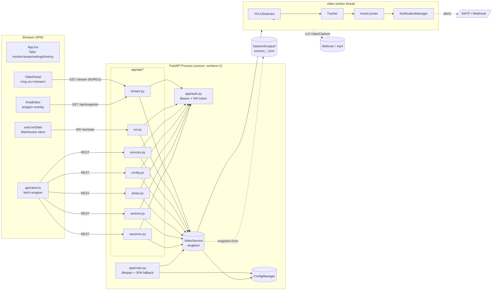

---

## 2. 클래스 다이어그램 — 백엔드 도메인

```mermaid
classDiagram
    class ConfigManager {
        +ModelConfig model
        +VideoConfig video
        +TrackingConfig tracking
        +CountingConfig counting
        +AlertConfig alert
        +EmailConfig email
        +LocationConfig location
        +UIConfig ui
        +load_config(path)
        +save_config()
    }

    class ModelConfig {
        +str model_path
        +float confidence_threshold
        +float iou_threshold
        +str device
        +int image_size
        +int max_det
        +bool half_precision
    }
    class VideoConfig {
        +str output_path
        +int frame_width
        +int frame_height
        +int fps_limit
        +int frame_skip
    }
    class TrackingConfig {
        +int distance_threshold
        +int max_disappeared
    }
    class CountingConfig {
        +list entrance_area
        +list exit_area
        +float min_residence_time
        +str area_name
    }
    class AlertConfig {
        +int overcrowding_threshold
        +int warning_threshold
        +int notification_interval
        +list[str] emergency_contacts
        +bool enable_email
        +tuple quiet_hours
    }
    class EmailConfig {
        +str smtp_server
        +int smtp_port
        +str sender_email
        +str sender_password
        +bool is_configured()
    }
    class LocationConfig {
        +str name
        +float latitude
        +float longitude
    }

    class VideoService {
        -ConfigManager config
        -YOLODetector detector
        -Tracker tracker
        -AreaCounter counter
        -NotificationManager notification_manager
        -cv2.VideoCapture _cap
        -Thread _thread
        -Event _stop_event
        -Lock _jpeg_lock
        -Lock _state_lock
        -bytes _latest_jpeg
        -dict _state
        +bool model_ready
        +start(source)
        +stop()
        +shutdown()
        +get_latest_jpeg() bytes
        +get_state() dict
        +apply_areas(entrance, exit_area, reset_counts)
        +apply_thresholds()
        +reset_counts()
        +save_state_snapshot()
        +restore_state_snapshot() bool
        +start_persistence_loop(interval)
        -_loop()
        -_process(frame)
        -_overlay(frame)
        -_alert_status(inside) str
    }

    class YOLODetector {
        +str device
        +YOLO model
        +detect(frame, target_classes)
        +detect_persons_only(frame) list
        +detect_with_nms(frame, iou)
        -_setup_device(device)
        -_load_model()
        -_predict(frame)
    }

    class Tracker {
        +dict center_points
        +dict disappeared
        +int distance_threshold
        +int max_disappeared
        +update(objects_rect) list
        +get_current_objects()
        +reset()
        +get_object_trajectory(id, max_points)
    }

    class AreaCounter {
        +list entrance_area
        +list exit_area
        +str area_name
        +set entered_ids
        +set exited_ids
        +float min_residence_time
        +update(tracked_objects)
        +get_counts() dict
        +get_hourly_stats() dict
        +reset_counts()
        +draw_areas(frame, show_counts)
        +save_history(filename)
        -_point_in(poly, x, y) bool
        -_record_transition(id, from, to, t)
    }

    class NotificationManager {
        +EmailNotifier email_notifier
        +SlackNotifier slack
        +DiscordNotifier discord
        +WebhookNotifier webhook
        +int overcrowding_threshold
        +int warning_threshold
        +int notification_interval
        +tuple quiet_hours
        +configure_email(...)
        +set_alert_rules(**rules)
        +check_and_send_alerts(count, location)
        +send_daily_report(data)
        +get_alert_history(limit)
        -_determine_alert_type(count) str
        -_should_suppress_alert(type, t) bool
        -_is_quiet_time(t) bool
    }

    class EmailNotifier {
        +str smtp_server
        +int smtp_port
        +configure(email, password)
        +send_emergency_alert(recipients, count, location)
        +send_periodic_report(recipients, data)
    }
    class SlackNotifier {
        +str webhook_url
        +send_emergency_alert(count, location)
    }
    class DiscordNotifier {
        +str webhook_url
        +send_emergency_alert(count, location)
    }
    class WebhookNotifier {
        +dict webhooks
        +add_webhook(name, url, headers)
        +send_to_all_webhooks(data)
    }

    ConfigManager *-- ModelConfig
    ConfigManager *-- VideoConfig
    ConfigManager *-- TrackingConfig
    ConfigManager *-- CountingConfig
    ConfigManager *-- AlertConfig
    ConfigManager *-- EmailConfig
    ConfigManager *-- LocationConfig

    VideoService o-- ConfigManager
    VideoService *-- YOLODetector
    VideoService *-- Tracker
    VideoService *-- AreaCounter
    VideoService *-- NotificationManager

    NotificationManager *-- EmailNotifier
    NotificationManager *-- SlackNotifier
    NotificationManager *-- DiscordNotifier
    NotificationManager *-- WebhookNotifier
```

---

## 3. 클래스 다이어그램 — FastAPI 레이어 (Pydantic 스키마)

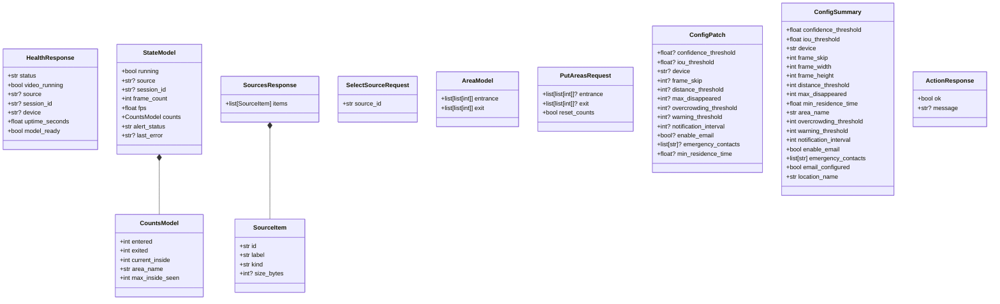

---

## 4. 시퀀스 — 비디오 소스 선택 및 라이브 스트림 시작

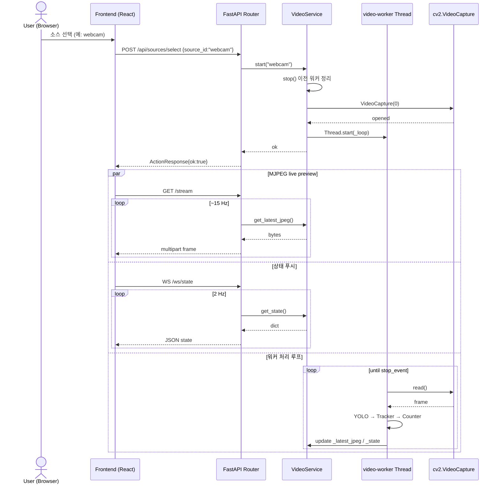

---

## 5. 시퀀스 — 영역 폴리곤 편집

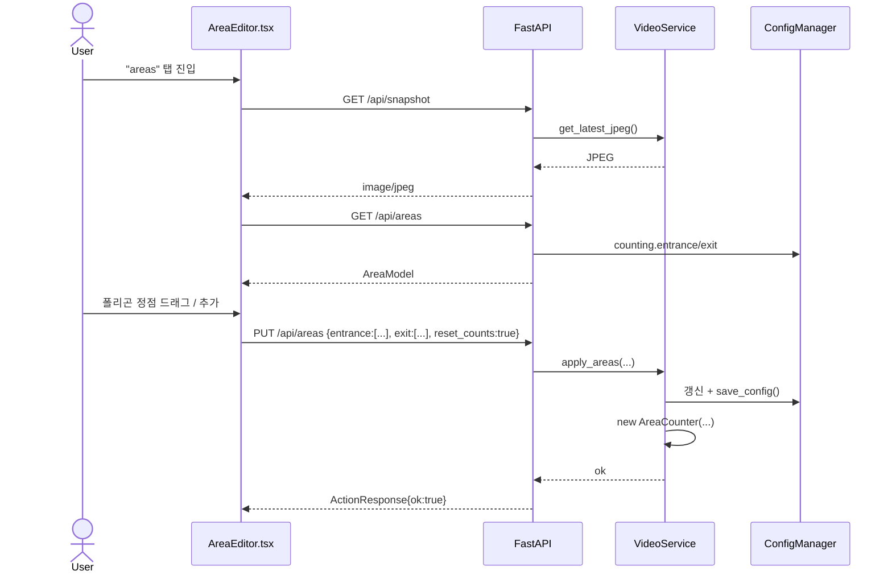

---

## 6. 시퀀스 — 과밀 경보 트리거

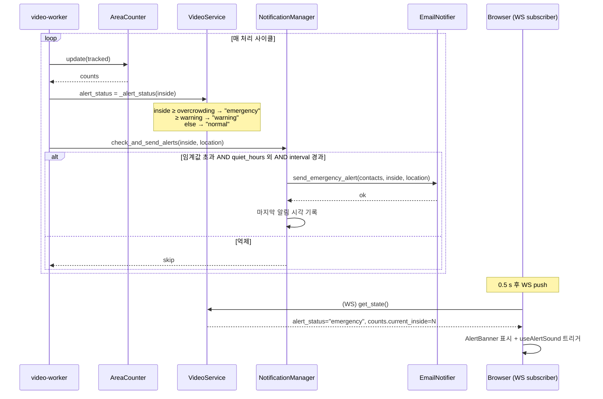

---

## 7. 상태 다이어그램 — VideoService 수명주기

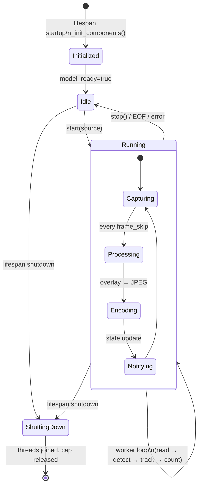

---

## 8. 상태 다이어그램 — Alert 상태머신

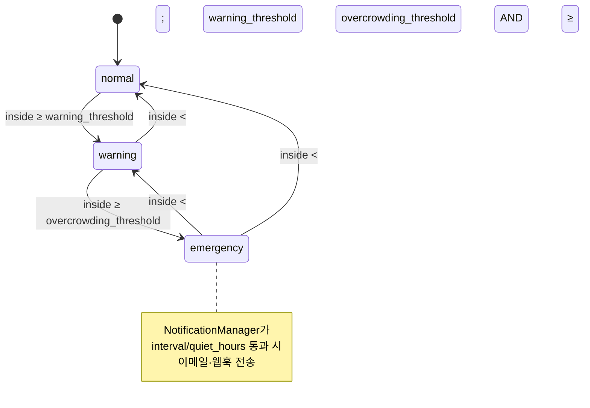

---

## 9. 활동 다이어그램 — 워커 루프 한 사이클

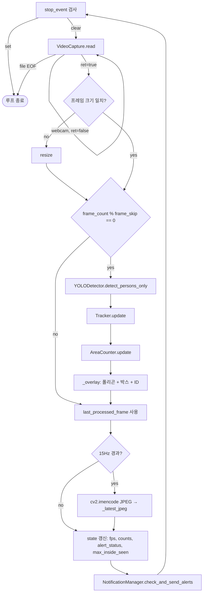

---

## 10. 배포 다이어그램

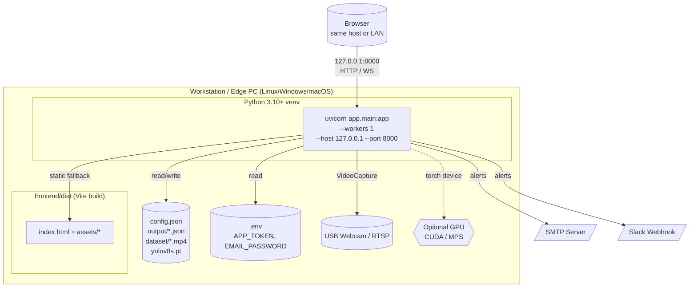

---

## 11. 프론트엔드 컴포넌트 트리

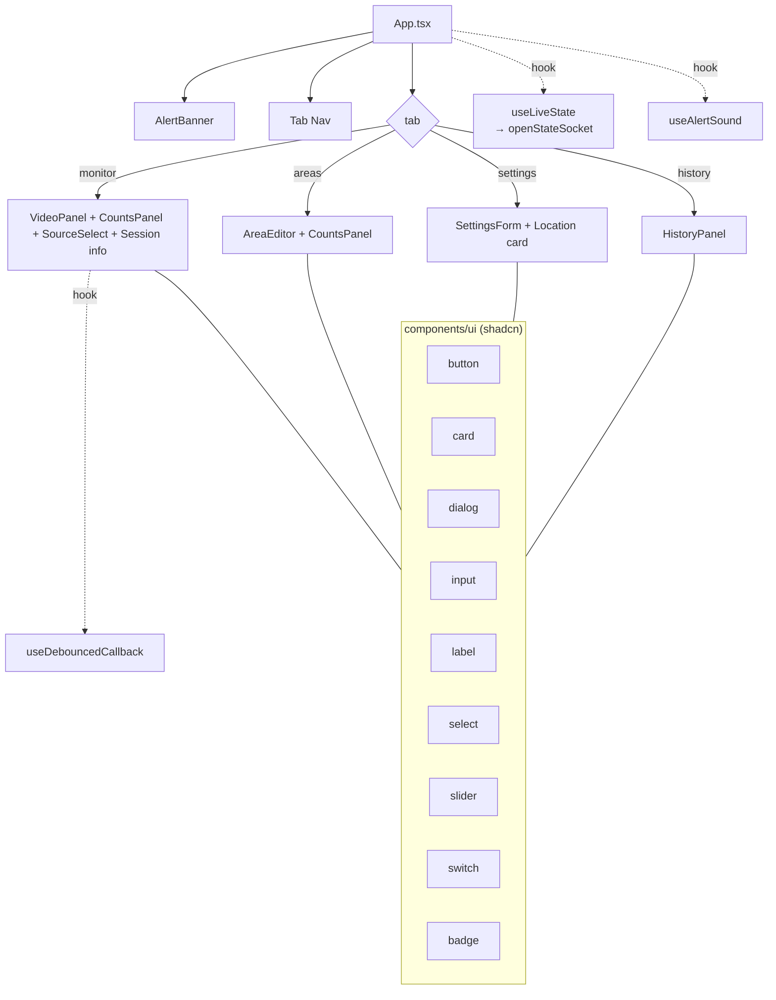

---

## 12. API 엔드포인트 매트릭스 (요약)

| Method | Path | 인증 | Request | Response | Router |
|--------|------|------|---------|----------|--------|
| GET | `/healthz` | — | — | `HealthResponse` | main |
| GET | `/stream` | Bearer | — | `multipart/x-mixed-replace` | stream |
| GET | `/api/snapshot` | Bearer | — | `image/jpeg` | stream |
| WS | `/ws/state` | `?token=` | — | `StateModel` JSON @2Hz | ws |
| GET | `/api/sources` | Bearer | — | `SourcesResponse` | sources |
| POST | `/api/sources/select` | Bearer | `SelectSourceRequest` | `ActionResponse` | sources |
| GET | `/api/config` | Bearer | — | `ConfigSummary` | config |
| PUT | `/api/config` | Bearer | `ConfigPatch` | `ConfigSummary` | config |
| GET | `/api/areas` | Bearer | — | `AreaModel` | areas |
| PUT | `/api/areas` | Bearer | `PutAreasRequest` | `ActionResponse` | areas |
| POST | `/api/actions/reset_counts` | Bearer | — | `ActionResponse` | actions |
| POST | `/api/actions/stop` | Bearer | — | `ActionResponse` | actions |
| POST | `/api/actions/save_state` | Bearer | — | `ActionResponse` | actions |
| POST | `/api/actions/restore_state` | Bearer | — | `ActionResponse` | actions |
| POST | `/api/actions/send_test_alert` | Bearer | — | `ActionResponse` | actions |
| GET | `/api/sessions` | Bearer | — | `SessionsResponse` | sessions |
| GET | `/api/sessions/{filename}` | Bearer | — | `application/json` | sessions |
